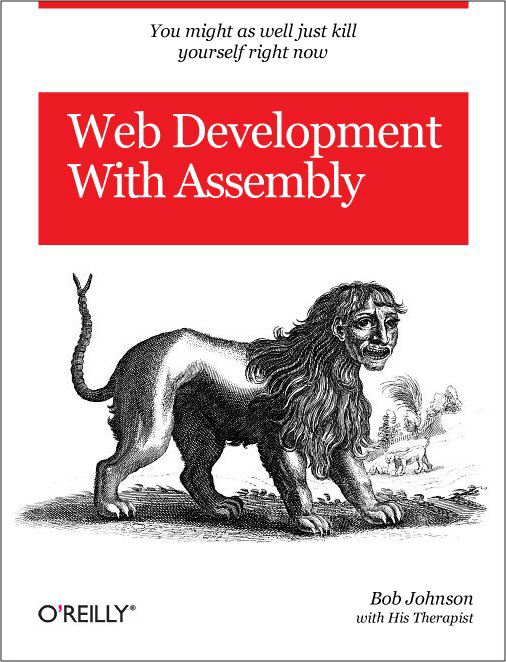

# *ymawky* -- web server in ARM assembly
This is *ymawky* (yuh maw kee), a web server written entirely in ARM64 assembly. ymawky is a syscall-only, no libc, fork-per-connection web server written by hand. While it is developed for MacOS, I've tried to make it as portable as possible -- *however*, it's likely you will still need to make some ~~(hopefully minor)~~ Significant tweaks to get this to run on Linux/other Unix systems. See [Implementation Notes](#implementation-notes) for more details.

## Building
Requires Xcode Command Line Tools. Install with `xcode-select --install`.
ymawky only runs on apple silicon (arm64).

Run `make` to build.

Ensure there is a `www/` directory next to the `ymawky` executable. That's the document root where *ymawky* searches for files.
`GET` with an empty filename (`GET /`) will search for `www/index.html`, so you might want to make sure there's an `index.html` as well.

*ymawky* will try to serve static error pages when a client's request results in error, eg 404. The pages it searches for in `err/(code).html`, so ensure `err/` exists alongisde `ymawky` and `www/`.
See [Configuration](#configuration) to modify the default file and docroot.

## Running
- `./ymawky` to start running the web server on `127.0.0.1:8080`.
- `./ymawky [port]` to start running the web server on `127.0.0.1:[port]`
- `./ymawky [literally-any-character-other-than-0-9]` to start running the web server on 127.0.0.1:8080 in debug mode. Debug mode disables forking, and makes ymawky only handle one request. (*I needed to do this because `lldb` wasn't letting me debug the children, ugh.*)

Unfortunately, while custom ports are supported, custom addresses are not. as of right now, ymawky can only run on `127.0.0.1`. This is solely because I haven't implemented it -- but if you'd like to consider this a safety feature, then I guess it could be intentional.

To see ymawky in action, start running ymawky with `./ymawky [port]`. Then open your web browser of choice (or use curl), and visit `127.0.0.1:8080/` or `127.0.0.1:8080/pretty/index.html`. Bask in the warmth of assembly.

## What can it do?
ymawky is a static-file web server. It doesn't support server-side code to generate content on-the-fly, or more advanced URL parsing, such as `/search?query=term`. That's not to say it's non-functional, though.
- Supported HTTP methods:
    - GET
    - PUT
    - DELETE
    - OPTIONS
    - HEAD
- Basic protection from slowloris-like Denial of Service attacks
- Decodes % hex encoding, eg, `%20` decodes to a space in filenames, and `%61` decodes to `a`
- Smart path traversal detection and prevention. Blocks `..` from traversing paths, while not disallowing multiple periods when they're part of a file:
  - `GET /../../../etc/passwd` -> `403 Forbidden`
  - `GET /ohwell...txt` -> `200 OK`
  - `GET /../src/ymawky.S` -> `403 Forbidden`
  - `GET /hehe..txt` -> `200 OK`
- Automatically prepends `www/` to requested files. `GET /index.html` will retrieve `www/index.html`
- Empty `GET /` requests default to `GET www/index.html`
- `PUT` requests support uploads of up to 1GiB, though this can be configured for larger files
- `PUT` is atomic due to writing to a temporary file then renaming, allowing concurrent `PUT` requests without leaving partially-written files
- `Content-Length:` parsing and verification in `PUT` requests
- MIME type detection, giving `Content-Type` in the response header with the corresponding MIME type
- Accepts `Range: bytes=` ranges in GET requests, supporting full ranges `bytes=X-N`, suffix ranges `bytes=-N`, and open-ended ranges `bytes=X-`. Video scrubbing is well supported
- Basic HTTP version parsing. Requests need to specify `HTTP/1.1` or `HTTP/1.0`, and if requesting `HTTP/1.1`, a `Host:` field needs to be present in the header. Currently, ymawky doesn't do anything with Host, but per RFC 9112 Section 3.2, the Header must be sent
- Serves custom HTML pages for error codes, such as 404, or 500. Look in the `err/` directory for an example
- If the requested resource is a directory, list all files and subdirs in the directory. Note that this excludes www/ (or whatever your docroot is): GET / will always search for index.html if no file is given.

## "Safety"
This is a web server written entirely by-hand in ARM64 assembly as a fun project. It's probably got a lot of vulnerabilities I'm unaware of. However, I did do my best to make it safer. Here are some safety precautions ymawky takes.
- Rejects paths >= PATH_MAX (4096 bytes)
- Reject any paths that include path traversal -- `/../..`
- Reject any requests that do not contain a path within 16 bytes
- Confined to `www/`. Any path requested gets `www/` prepended to it
- Rejects any path containing symlinks, with O_NOFOLLOW_ANY
- PUT writes to a temporary file, `www/.ymawky_tmp_<pid>`. Upon successfully receiving the whole file, this temporary file is then renamed to the requested filename. This prevents partial or corrupted PUT requests from overwriting existing files.
- Reject any requests whose path starts with `www/.ymawky_tmp_`. This prevents someone from `GET`ing a temporary file, and prevents someone from sending `PUT /.ymawky_tmp_4533` or something.
- Must receive data within 10 seconds. If it's slower, the connection will close. If the entire header is not received within 10 seconds total, the connection will be closed. This is to prevent slowloris-like attacks.

## HTTP Status Codes
ymawky currently supports and can reply with the following status codes:
- `200 OK`
- `201 Created`
- `204 No Content`
- `206 Partial Content`
- `400 Bad Request`
- `403 Forbidden`
- `404 Not Found`
- `408 Request Timeout`
- `409 Conflict`
- `411 Length Required`
- `413 Content Too Large`
- `414 URI Too Long`
- `416 Range Not Satisfiable`
- `418 I'm a teapot`
- `431 Request Header Fields Too Large`
- `500 Internal Server Error`
- `501 Not Implemented`
- `503 Service Unavailable`
- `505 HTTP Version Not Supported`
- `507 Insufficient Storage`

Custom HTML pages will be served alongside the error codes (400+). These HTML files are located in `err/(code).html`. You can use `build_err_pages.sh` to create a page for each code, with different text at your leisure. Edit the source code of `build_err_pages.sh` to modify the text per-page, and modify `err/template.html` to modify the base template. In `err/template.html`:
- `{{CODE}}`  - HTTP Code: eg, 404
- `{{TITLE}}` - Title text: eg, "Not Found"
- `{{MSG}}`   - Custom message: eg, "the rats ate this page"

## MIME Types
MIME types are detected by analyzing the file extension. The following MIME types are recognized.

Web-related files:
- `.html`  -> `text/html; charset=utf-8`
- `.htm`   -> `text/html; charset=utf-8`
- `.css`   -> `text/css; charset=utf-8`
- `.csv`   -> `text/csv; charset=utf-8`
- `.xml`   -> `text/xml; charset=utf-8`
- `.js`    -> `text/javascript; charset=utf-8`
- `.json`  -> `application/json`
- `.wasm`  -> `application/wasm`
- `.mjs`   -> `text/javascript; charset=utf-8`
- `.map`   -> `application/json`

Image files:
- `.png`   -> `image/png`
- `.jpg`   -> `image/jpeg`
- `.jpeg`  -> `image/jpeg`
- `.gif`   -> `image/gif`
- `.svg`   -> `image/svg+xml`
- `.ico`   -> `image/x-icon`
- `.webp`  -> `image/webp`
- `.avif`  -> `image/avif`
- `.bmp`   -> `image/bmp`
- `.tiff`  -> `image/tiff`
- `.apng`  -> `image/apng`

Font files:
- `.woff`  -> `font/woff`
- `.woff2` -> `font/woff2`
- `.ttf`   -> `font/ttf`
- `.otf`   -> `font/otf`

Document files:
- `.txt`   -> `text/plain; charset=utf-8`
- `.pdf`   -> `application/pdf`
- `.doc`   -> `application/msword`
- `.docx`  -> `application/vnd.openxmlformats-officedocument.wordprocessingml.document`
- `.epub`  -> `application/epub+zip`
- `.rtf`   -> `application/rtf`

Video files:
- `.mp4`   -> `video/mp4`
- `.webm`  -> `video/webm`
- `.mkv`   -> `video/x-matroska`
- `.avi`   -> `video/x-msvideo`
- `.mov`   -> `video/quicktime`

Audio files:
- `.mp3`   -> `audio/mpeg`
- `.ogg`   -> `audio/ogg`
- `.wav`   -> `audio/wav`
- `.flac`  -> `audio/flac`
- `.aac`   -> `audio/aac`
- `.m4a`   -> `audio/mp4`
- `.opus`  -> `audio/opus`

Archive files:
- `.zip`   -> `application/zip`
- `.gz`    -> `application/gzip`
- `.tar`   -> `application/x-tar`
- `.7z`    -> `application/x-7z-compressed`
- `.bz2`   -> `application/x-bzip2`
- `.rar`   -> `application/vnd.rar`

## Configuration
You can configure ymawky with the `config.S` file. The options are documented here.
- `#define DEFAULT_DIR "www/"` -- This is the docroot. Change it to wherever your HTML files are, relative to ymawky, or use an absolute path:
  - `#define DEFAULT_DIR "www/"`
  - `#define DEFAULT_DIR "/Library/WebServer/Documents`
  - `#define DEFAULT_DIR "./"`
- `#default ERR_DIR "err/"` -- This is the directory in which ymawky will search for custom error HTML pages, eg, `err/404.html` or `err/500.html`
- `#define DEFAULT_FILE "index.html"` -- This is the default file ymawky will serve when it receives an empty `GET / HTTP/1.1` request
- `.equ RECV_TIMEOUT, 10` -- Number of seconds ymawky will wait to receive datta before closing the connection. If it's more than `RECV_TIMEOUT` seconds between `read()`s, ymawky will close the connection with `408 Request Timed Out`
- `.equ HEADER_REQ_TIMEOUT_SECS, 10` -- Maximum number of seconds ymawky will wait to receive the full header before timing out. If it takes, longer than this to receive the header, ymawky will close the connection with `408 Request Timed Out`
- `.equ PUT_GRACE_SECS, 5` -- ymawky dynamically calculates a max-time-per-PUT based on `Content-Length`. The max time is defined as `PUT_GRACE_SECS + Content-Length / PUT_MIN_BPS`. This is the minimum grace period allowed if it calculates a file should take <1 second to upload
- `.equ PUT_MIN_BPS, 1024 * 16` -- Minimum bytes-per-second. Higher if you want to be stricter, smaller if you want to be more lenient. Since this uses the `.equ` directive, arithmetic is supported, and `1024 * 16` gets calculated at assembly time becoming `16384` or 16KB
- `.equ MAX_BODY_SIZE, 1024 * 1024 * 1024` -- Maximum bytes PUT allows for Content-Length. By default, 1GB (1024*1024*1024 = 1073741824 bytes). Files with a larger Content-Length larger than this will be rejected with `413 Content Too Large`
- `.equ MAX_PROCS, 256` -- Maximum number of concurrent proccesses ymawky is allowed to run. Since ymawky is a fork-per-connection server, you want to ensure ymawky doesn't exhaust your PID space. ymawky will reply with `503 Service Unavailable`

## Implementation Notes
ymawky is written for MacOS (sorry...). There are a few (well, more than a *few*) things that are MacOS-specific in this code that won't be portable.
- Syscalls on MacOS use `x16` for the number and `svc #0x80` to call it. Linux uses `x8` and `svc #0`.
- Error reporting is different. MacOS sets the carry flag on error, and puts `errno` in `x0`. Linux returns a negative value in `x0`, like `-ENOENT`. Ever `b.cs` would need to be replaced with `cmp x0, #0` / `b.lt ...`, and you'd negate `x0` to get errno.
- `fork()` works differently, MacOS puts 1 in `x1` in the child process, whereas Linux puts `0` in `x0`.
- `SO_NOSIGPIPE` doesn't exist on Linux.
- `O_NOFOLLOW_ANY` is also MacOS-specific.
- `renameatx_np()` is also MacOS-specific. Linux has `renameat2()`, with different flag values.
- Struct layouts and offsets will differ. The `stat64` struct, `itimerval` struct, and `sockaddr_in` struct, will all need to be reconsidered.
- `adr xN, foo@PAGE` / `add xN, xN, foo@PAGEOFF` are Mach-O relocation operators. Linux ELF uses different syntax, like `:pg_hi21:` and `:lo12:`. The `adr_l`, `ldr_l` and `str_l` macros would need to be rewritten or replaced.
- My personal favorite :3 Signal handling works differently on Linux and MacOS. MacOS's `sigaction` struct contains a `sa_tramp` field that the kernel jumps to before your handler. ymawky utilizes `sa_tramp` directly *as the handler itself*, skipping the libc trampoline and `sigreturn` entirely. Since the handler only sends a 408 and exits, without needing to return, that's fine and works wonderfully without libc. The `sigaction` call would need to be rewritten for POSIX systems.

### Special Thanks:
- *Bob Johnson*
- *Bob Johnson's Therapist*
