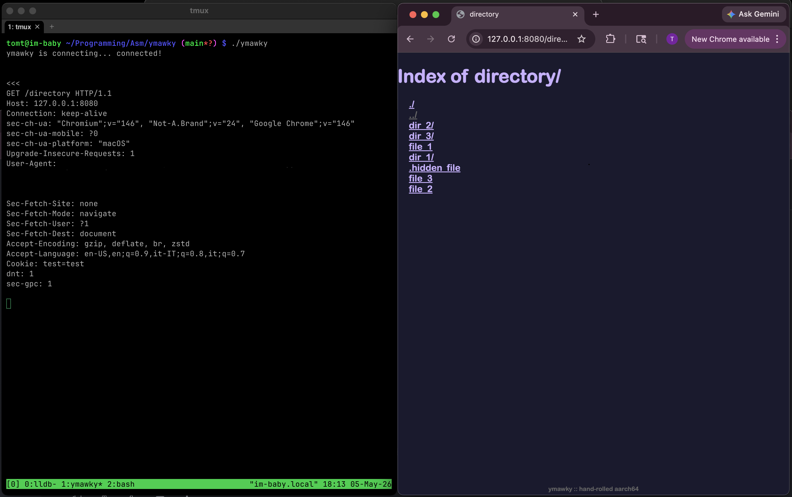
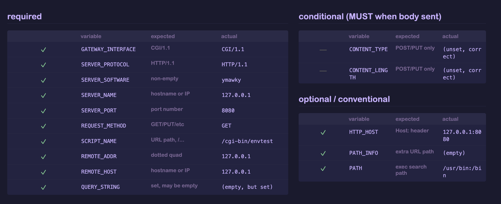

# building a web server in aarch64 assembly to give my life (a lack of) meaning
ymawky is a small, ~~static~~ dynamic http web server written entirely in aarch64 assembly for macos. it uses raw darwin syscalls with *no* libc wrappers, serves static files, supports `GET`, `HEAD`, `PUT`, `OPTIONS`, `DELETE`, byte ranges, directory listing, custom error pages, CGI scripts, and tries to be as hardened as possible.

why? why not? the dream of the 80s is alive in ymawky. everybody has nginx. having apache makes you a square. so why not strip every single layer of convenience that computer science has given us since 1957? i wanted to understand how a web server actually works, something i know little about coming from a low-level/systems background. the risks that come up, the problems that need to be solved, the things you don't think about when you're writing python or c.

this *(probably)* won't replace nginx, but it *is* doing something in the most difficult way possible.

<figure style="text-align: center;">
  
  <figcaption><em>ymawky serving a directory listing</em></figcaption>
</figure>

## constraints
i gave myself some constraints for this project:

* aarch64 assembly only
* macos/darwin, not linux. only because that's the system i have right now. sorry linuxheads :(
* raw syscalls only: **no** libc wrappers
* no preexisting parsers
* absolutely **no** external libraries

## assembly, my beloved

assembly language is the layer between machine code and other languages. c gets compiled into assembly, which then gets assembled into an executable binary. assembly is essentially human-readable mnemonics that directly correspond to raw executable bytes: `mov`, `add`, `ldr`, `str`, `cmp`, among others. `svc #0x80` is the human-readable equivalent to the bytes `D4 00 10 01` you'll find in the executable binary.

you get almost no abstractions. you move values around between cpu registers and memory, compare them, jump to different portions of your code, and call the kernel for syscalls. it makes simple things look complicated, but it also makes almost every step the cpu takes visible and under your control. it does exactly what you tell it to, without warnings, and without any help. if it's behaving incorrectly, it's because *you* wrote it incorrectly.

writing a web server in assembly means there are no http libraries. no automatic cleanup. no string types: strings are just regions of memory that hold individual bytes sequentially. a `struct` as it exists in c doesn't really exist as a language feature. you have to know the exact offset in bytes between each field, and the total size of the struct, or the cpu will happily read the wrong memory.

## raw syscalls

ymawky doesn't use any libc wrappers, it just uses raw calls to the kernel. take, for example, this snippet of code that opens a file:

```asm
mov x16, #5 ; SYS_open syscall number
adrp x0, filename@PAGE
add x0, x0, filename@PAGEOFF
mov x1, #0x0 ; O_RDONLY is just 0x0000
svc #0x80
b.cs open_failed
```

in darwin, the syscall number goes in the `x16` register (in aarch64 linux, it goes in `x8`). syscall number 5 is `open()`, which takes a couple arguments: filename and mode. you put each argument in the registers by hand, then call the kernel with `svc #0x80`.

if `open()` fails, the carry flag is set. we check that with `b.cs open_failed`, which means "if the carry flag is set, branch to `open_failed`". then we have to write `open_failed` to do whatever cleanup and response handling is needed.

this happens a lot. assembly doesn't have "exceptions" or "objects", it just sets a cpu flag that you have to check and deal with.


## general overview
at its most basic, a web server receives a request, processes it, returns a status code, and maybe a file. a lot goes into that "receives a request" bit:

* set up sockets with `socket(AF_INET, SOCK_STREAM, 0)`
* configure the socket with `setsockopt(serverfd, SOL_SOCKET, SO_REUSEADDR, &buf, sizeof(int))`
* bind a file descriptor to an address with `bind(sockfd, &addr, 16)`
* listen to the socket for new connections with `listen(sockfd, 5)`
* accept a connection with `accept(sockfd, NULL, NULL)`

ymawky is a fork-on-request server. that means for each new inbound connection, it calls the `fork()` syscall. this has some advantages:

* memory is not shared between request handlers
* it's easier to understand
* it's easier to write

but it also has some pretty significant disadvantages:

* bloat
* each process has its own memory space
* it fundamentally handles fewer concurrent connections than models like nginx's event-driven async non-blocking model
* with more concurrent connections, the kernel spends more time switching between processes than actually being *in* the process
* did i mention the bloat? and memory consumption?

binding to sockets and listening is the easy part. the real soul-crushing task is processing requests. a lot goes into this:
* determining request type: `GET`, `HEAD`, `OPTIONS`, `PUT`, `POST`, or `DELETE`
* extracting the requested path
* normalizing the path, like decoding `%20` into a space
* performing safety checks on the path
* parsing header fields the client sent over
* getting information about the requested file
* figuring out whether it is a directory or a regular file
* writing upload bodies to temporary files for `PUT`
* building response headers
* writing the response, which is somehow not straightforward
* closing any open files
* handling errors without crashing the server

## parsing http by hand

i *hate* string parsing. *especially* in assembly. unfortunately, an http request is just a string asking a server to do something, and the server has to understand it.

let's walk through an example http request:

```http
GET /index.html HTTP/1.0\r\n
Range: bytes=1-5\r\n\r\n
```

that first line tells us a lot. it's a `GET` request, which means the client would like us to send over `index.html`. `HTTP/1.0` tells the server what version of http the client is using. the `\r\n` sequence, carriage return plus linefeed, tells the server "that's the end of this line, please process the next one". the `\r\n\r\n` at the end tells the server that's the end of the header. if we never receive `\r\n\r\n`, we have to bail with `400 Bad Request`.

then there is `Range: bytes=3-5`, which means "from this file, only give me bytes 3 through 5, ignore the rest." if a file is 500gb large, but you only request bytes 3 through 5, you only receive 3 bytes back. *yay!* unfortunately for me, i have to process that header. *boo!*

first, ymawky determines the request type by comparing the first few bytes against every method it supports, then it extracts the path.
we scan along the header one byte at a time until we find a `/` or `*`. but we can't assume every `/` is the requested path. if somebody sends:
```http
GET HTTP/1.0\r\n
\r\n
```
there is a `/` in `HTTP/1.0`. once we hit a `/`, we check that the *previous* byte was a space. if it wasn't, we reply with `400 Bad Request`.

once we find the path, we need somewhere to store it. on most systems, `PATH_MAX` is 4096 bytes, so ymawky has a 4096 byte filename buffer plus one byte for the null terminator:
```asm
.bss
filename_buffer: .skip 4097
.align 3
```

copying the filename is just a loop, but the loop has to constantly check both sides: don't read past the header, and don't write past the filename buffer. if the client requests `GET /aa...[5000 A]...a HTTP/1.0`, they should get `414 URI Too Long` rather than overwriting 5KB of arbitrary memory.

in python, this is something like:

```python
text.split("GET /")[1].split(" ")[0]
```
in assembly, it's ~200 lines long, including ensuring HTTP legality.
isn't assembly the best?

then the path has to be percent-decoded. if the parser sees `%`, it has to read the next two bytes, verify that they are valid hex characters (`0-9`, `a-f`, `A-F`), convert them into the byte they represent, and continue.

`GET` requests can have a `Range:` header, and `PUT` requests require `Content-Length:`. unlike the requested URL, these can appear at any line in the header. we have to iterate through the header character by character. if we find a `\r`, we need to check if the next character is `\n`. if it's not, it's a malformed header, and we have to send a `400 Bad Request`. likewise, if we find a `\n` without a preceding `\r`, it's also malformed. once we find `\r\n`, that marks the end of the current line, and the beginning of the next. we check if this new line starts with a space, and send a `400 Bad Request` if it does (header fields cannot start with whitespace). then we check for `Range:` (or `Content-Length:`, depending on the method), using a little string comparison function:
```asm
streqn:
    ldrb w3, [x0]
    ldrb w4, [x1]
    cmp w3, w4
    b.ne Lstreqn_no_match

    cbz w3, Lstreqn_match ;; both equal and both NULL = end of string = match

    ;; if we've reached the end, it's a match yeah?
    subs x2, x2, #1
    b.eq Lstreqn_match

    add x0, x0, #1
    add x1, x1, #1
    b streqn

Lstreqn_match:
    mov x0, #1
    ret

Lstreqn_no_match:
    mov x0, #0
    ret
```
this takes two string pointers, `x0` and `x1`, a max length in `x2`, and checks if each character is the same.

let's see what a `Range:` header can look like:

```http
Range: bytes=10-
Range: bytes=-10
Range: bytes=5-10
```

both sides of the range are optional, but at least one of them is required. since "10" is a string and not a literal 10, each side has to be converted from ascii digits into an integer. we have to write an `atoi`-style function, being careful to check for an integer overflow:

```asm
;; x0 -> pointer to string
atoi:
    mov x1, #0
    mov x3, #10
    mov x4, #0
1:
    ; if the number is >=19 digits long, it could overflow the 64-bit registers
    cmp x4, #19
    b.hs Latoi_error

    ldrb w2, [x0]
    cbz w2, 2f

    cmp w2, #'0'
    b.lo Latoi_error
    cmp w2, #'9'
    b.hi Latoi_error

    ; result = (result * 10) + current digit
    mul x1, x1, x3
    sub w2, w2, #'0'
    add x1, x1, x2
    add x0, x0, #1
    add x4, x4, #1

    b 1b
2:
    cmn xzr, xzr ; clear carry to signal success
    mov x0, x1
    ret

Latoi_error:
    cmp xzr, xzr ; set carry to signal failure
    mov x0, #0
    ret
```

in python, that would be `int(string)`. isn't assembly magical?


## put

`PUT` is interesting. it's idempotent, meaning the end result on the server is the same regardless of how many times you send the same request. `PUT /file.txt` will create `file.txt`, or completely overwrite it if it already exists. putting `1234` to `file.txt` twice in a row results in one file that contains `1234`, not `12341234`.

this makes `PUT` honestly pretty dangerous to have open globally, but hey, who cares?

there are a few things to consider when handling `PUT`:

* what if the process crashes in the middle of handling the request?
* what if the client says the `Content-Length` is 2kb, but only sends 100 bytes?
* what if the client says the `Content-Length` is huge, like 50gb?

that last one is easy to fix. configure a maximum file size. in `config.S`, `MAX_BODY_SIZE` is 1gb by default. if `Content-Length` is larger than that, ymawky refuses the request with `413 Content Too Large`. easy peasy.

the first two have the same basic fix. if we blindly opened `file.txt` and started writing into it, the file could be left half-written if something goes wrong. so instead, ymawky writes to a temporary file:

```text
.ymawky_tmp_<pid>
```

to get the pid, we use `getpid()` (syscall #20), then a custom `itoa()` to convert the number to a string (while checking for buffer overflow, of course). then, the requested content from the client gets written to the temp file. if everything goes smoothly, the temp file is renamed in place, and `file.txt` now exists on the server. if the client disconnects unexpectedly, times out, or sends a malformed body, the temp file is `unlink()`'d (syscall #10/syscall #472 for `unlinkat()`). existing files are only overwritten after a complete request was sent over successfully.
## directory listing and more string parsing *yay*
have you ever noticed sometimes you visit a directory on a website, and it lists all the files with links you can click on? it seems like pretty basic functionality, and it's not *too* complicated. but like everything in assembly, you have to do everything by hand.

if you `GET /somedir/`, we check if directory listing is enabled (`ALLOW_DIR_LISTING` in `config.S`). if it's not, we send a `403 Forbidden` and call it a day.

if it is allowed, we call `getdirentries64()` (syscall #344) on the requested directory. this fills a buffer with information about every file in the directory. importantly for us, it includes the name of each file, and the length of the filename.

we use that name information to build some HTML, making the directory listing clickable-and-pretty.
for each file, we write this to the client:
```html
<a href="filename">filename</a>
```

but those two `filename`s need to be treated and sanitized differently.
inside `href="..."`, the filename has to be percent-encoded for a url/path segment. in the visible body text, it has to be html-escaped.

for a file named:
```text
&.-~><foo
```
the href should be:
```text
%26.-~%3E%3Cfoo
```
but the visible text should be:
```html
&amp;.-~&gt;&lt;foo
```
so the final output is:
```html
<a href="%26.-~%3E%3Cfoo">&amp;.-~&gt;&lt;foo</a>
```

a file named `<script>something evil</script>` (which would allow XSS for the visible portion) or `"><script>something dastardly</script>` (which would allow XSS in the `href="..."` portion) is safely encoded, rather than being executed.

## network security

there is a type of denial-of-service attack called slowloris. ymawky is heaven for slowloris.

slowloris works by opening lots of connections to a server and then not ending the request. the connections stay open, no complete request arrives, and the server keeps resources tied up waiting.

so how do we protect against it? if the entire header is not received within a configured timeout (`HEADER_REQ_TIMEOUT_SECS` in `config.S`), the client gets `408 Request Timeout` and the connection closes. if the client stops sending data for too long during a request body (`RECV_TIMEOUT` in `config.S`), same thing.

but a per-read timeout isn't enough. what if a malicious client sends:

```http
PUT /file.txt HTTP/1.0\r\n
Content-Length: 1073741823\r\n
\r\n
```
and then sends one byte every 9 seconds? the request will be accepted, since the content length is 1 byte under our maximum. if the only timeout is 10 seconds per byte, the server would continue patiently waiting for over 300 years. not good. pretty bad.

to minimize this, ymawky calculates a timeout based on `Content-Length` and a minimum bytes-per-second transfer speed:
```text
timeout = grace_period + content_length / min_bps
```
`grace_period` is the minimum amount of time given to any body. `min_bps` is the slowest transfer speed the server is willing to tolerate. by default, it is generous at 16KB/s, but not infinite. this doesn't make ymawky impervious to denial-of-service attacks, but it does limit how long certain types of attacks will tie up resources.
## filesystem safety
for `GET` and `HEAD` methods, ymawky opens the requested path and then calls `fstat64()` (syscall #339) on the file file descriptor, to get things like file type and filesize.

checking with `stat64()` (syscall #338) on the path *first*, and *then* opening the file has a potential time-of-check/time-of-use race condition; the file you checked might change in the microseconds before it's opened.
### malicious requests
imagine a server running with no regard for file sensitivity. anything is fair game. someone could request:

```http
GET /etc/shadow HTTP/1.0\r\n
\r\n
```

and own the system. that's no fair! we've got to do something!

first, all requested paths get a docroot prepended to them. by default, it's `www/` (`DOCROOT` in `config.S`). a request for `/etc/shadow` becomes a request for `www/etc/shadow`, which should 404 (unless you have a directory named `etc/` inside `www/`, with a file named `shadow`).

problem solved!

...

ok, it's not that simple.

anyone even slightly familiar with unix-y filesystems knows about `..`, or path traversal. they could request:

```http
GET /../../../../etc/shadow
```

which becomes:

```text
www/../../../../etc/shadow
```

which resolves outside the docroot. that's pretty stupid. we've got to deny traversal attempts, but without being too strict. we don't want to reject everything that matches a naive substring search for `..`, because `ohwell...png` is a perfectly valid filename.

so ymawky rejects *path segments* that are exactly `..`. this needs to be done *after* decoding percent-encoding, because `%2E%2E` becomes `..` after decoding.

but wait! what about symlinks?

`open()` (syscall #5) has the flag `O_NOFOLLOW` defined by POSIX, which makes the call fail if the final path component is a symlink. but what if some directory in the middle of the path is a symlink? darwin has `O_NOFOLLOW_ANY` as well, which will fail if *any* element of the path is a symlink.

of course, if someone can plant a specific symlink inside your docroot, odds are something has already gone pretty wrong. but still, can't hurt.

## CGI Script Support

<figure style="text-align: center;">
  
  <figcaption><em>ymawky displaying a dynamically-generated page via CGI script</em></figcaption>
</figure>

ymawky now has added support for dynamic, server-side scripting through CGI scripts, or [Common Gateway Interface](https://en.wikipedia.org/wiki/Common_Gateway_Interface). it's no longer just a static file web server! eagle-eyed readers might notice that previously, i called ymawky a static file server, or that "only serving static files" was a *constraint* i gave myself on purpose. at first it was, i didn't have any desire to add dynamic content. but as this project has grown, so too have my goals for it. the main reason i made it static file *only* was because it seemed *much* too complicated to add support for CGI. but this project would be nothing if not complicated-for-the-sake-of-being-complicated, so i've added support for CGI scripts.

these are executable programs or scripts that live on the server. when a request is sent to a CGI script, rather than going through the normal `GET`/`PUT`/etc method handler, the server forks and executes the script using `execve()` (syscall #59), and forwards the request to be handled by the script. to do this, ymawky needs to set environmental variables that give the script some context. things like who sent the request, what type of request, content length/type (for `PUT` and `POST` requests), remote client's IP address, server's IP address and port, query string, among others. this introduced a lot of new problems to solve.

### environmental variables
`execve()` lets you pass environmental variables as an array of pointers to strings. assembly doesn't have data types like that, so we need to build an array of pointers. but the pointers need to actually *point* to some part of memory, so we need to store those strings somewhere. we can do this by allocating some space in memory:
```asm
.bss
env_var_string_buffer:  .skip 4096
env_var_pointer_buffer: .skip 512
```
this creates two chunks in memory, one 4096 bytes large, the other 512 bytes large. we use our homebrew `memcpy` to copy whatever text we'd like into `env_var_string_buffer`, followed by a NULL character. after copying, the buffer looks something like this, where `*` represents a NULL character:
```
GATEWAY_INTERFACE=CGI/1.1*SERVER_PROTOCOL=HTTP/1.1*SERVER_SOFTWARE=ymawky*
```
as we're building this buffer, we also have to set up the pointers to the start of each string. `env_var_pointer_buffer` is tightly packed, containing a pointer to the beginning of each string:
```
GATEWAY_INTERFACE=CGI/1.1*SERVER_PROTOCOL=HTTP/1.1*SERVER_SOFTWARE=ymawky*
^                         ^                        ^
0x0000000100009ff4        0x000000010000a00e       0x000000010000a027
```
each pointer is 8 bytes long, so if somehow we used up all 4096 bytes of `env_var_string_buffer`, we could have a corresponding pointer to the start of each string. now we can pass `env_var_pointer_buffer` to `execve()`, it will set our environmental variables, and the script can access them via `$GATEWAY_INTERFACE` (or however the scripting language used accesses any environmental variable).

### communication with CGI script
CGI scripts put their output directly to `stdout`, and read directly from `stdin`. so we have to create some pipes, using the syscalls `pipe()` (syscall #42) to create them, and `dup2()` (syscall #90) to map them to stdout/stdin. now the parent can write to the script's `stdin`, and read from the script's `stdout` to be forwarded `stdout` to the HTTP client. much like the general `PUT` handler, CGI scripts that called with the `PUT` or `POST` methods have the same dynamically calculated timeout based on content length to prevent slowloris-like attacks.

### parsing CGI headers
CGI scripts send headers just like HTTP itself, but with some differences. this allows the script to set their own response code (`200 OK`, `404 Not Found`, etc) and other headers (`Content-Type:`, `Content-Length:`). since the parent process has no way of knowing what the script is going to output, we have to use these in our response header. but CGI headers are more lenient than HTTP headers: in an HTTP header, all lines must end in `\r\n`, and the header itself must end in `\r\n\r\n`. CGI scripts are allowed to have each line in the header end with a single `\n`, and the header as a whole may end in `\n\n` (`\r\n` and `\r\n\r\n` are also acceptable, however). so we have to write a whole host of new parsing functions to deal with CGI headers, as the main parsing functions only deal with HTTP.

once we reach the end of the CGI script's headers, we output them to the client literally. we have to skip the `Status:` header, though, since that gets converted to the first line of our response, eg, `HTTP/1.1 200 OK\r\n`. we also need to strip the `Connection:` header, ymawky always sends `Connection: close` and doesn't support keep-alive (yet...?).

### limitations
CGI scripts are their own programs. ymawky has no control over what they do. we [cant detect if they're in an infinite loop](https://en.wikipedia.org/wiki/Halting_problem), if they're reading data from outside of the docroot, or anything else. so a CGI script could hang forever, and we can't really do anything about it. they can also have their own vulnerabilities; that's outside of our control.

## apple-specific behavior

in order for request timeouts to work, we have to use `setitimer()` (syscall #83) to send `SIGALRM` after a certain amount of time has passed. by default, `SIGALRM` will just kill the child, but we want to send a `408 Request Timeout` message first.

we use `sigaction()` (syscall #46). on darwin, the raw sigaction struct exposes a `sa_tramp` field. typically, libc will set up `sa_tramp` *for* you, and you don't have to think about it. it saves the stack, registers, sets up `sigreturn`, all that jazz, and then branches into your handler. if `sa_tramp` *doesn't* do that, the program won't know where to return to when the handler is done.

but in ymawky, the timeout handler never *needs* to return. it sends a `408 Request Timeout`, closes what it needs to close, and exits the child. because it never returns, i can point the trampoline slot at code that performs the timeout response directly, and bypass `sa_handler` and `sigreturn` entirely.

apple also has a little-documented syscall, `proc_info()` (syscall #336), which allows you to get information about a running process, including its children. this is normally used by tools like `ps`, `lsof`, and `top`, but ymawky uses it to count active child processes.

since ymawky has a configurable maximum number of connections, it needs to know how many children are alive. `proc_info()` writes child process info to a buffer. since each element has a known size, the server can determine the number of children by looking at how many bytes were written. if there are more than `MAX_PROCS`, new connections get rejected with `503 Service Unavailable`.

yay!

## ai disclosure
this project is hand-written. it was a learning process for myself to understand both web servers and assembly. i would be doing myself a disservice if i simply vibe-coded it or copy/pasted from an ai after prompting it *"cool, now give it DELETE support"*. all of the assembly in here is written by hand, after many real human hours of toiling in vim and lldb.

that being said, i did turn to ai at some points during the development of ymawky. unfortunately it's almost unavoidable, since every time you google something, google gives you that awful little ai overview. i mainly used it for understanding the http/cgi spec: header formatting, requirements for different methods, what should result in errors vs get silently ignored. it was also used sparingly to help me find bugs that i had been unable to figure out.

but, the only ai-generated code in this repository is html. i'm sorry, but i genuinely do not care about front-end web development at all, really, and know next to no html/css/javascript. i just want pages to look nice, so i tweaked the resulting html pages to my liking.

tl;dr: all of the assembly is artisenal, hand-crafted, human assembly. some of the content is www/ is the work of dirty, dirty robots.

# conclusion
<p style="text-align: center;">
  
</p>
everybody should write more assembly. who cares about security? who cares about ease? why write a 100 line python script when you could write 4,000 lines of assembly? why have productive days when you could spend 7 hours debugging string parsing for the 10th day in a row? *(hint: you wrote `[x3, #1]` instead of `[x3], #1`).*

more seriously, the hard part of writing a static web server was not opening a socket or listening for requests. the hard part was parsing the request and handling every edge case. every request is bytes. every path is bytes. every response is bytes. every range needs to be exact. every filename has to be escaped differently.

my [hacker news post](https://news.ycombinator.com/item?id=48080587) also sparked a lot of interesting discussion. a lot of people were focused on ai and its relationship to programming. this isn't an ai project, it never was, and never will be. what would even be the point of this if i just generated it? the goal isn't to have *a* web server that's written in assembly, the goal is to *write* one. by hand, as a human person. to get down to the metal on the machine and control *everything* just because i can.

i think *people* need to write more assembly. not *have assembly written for them by an llm*. 
assembly makes *you* do *everything* by hand. isn't that great?
